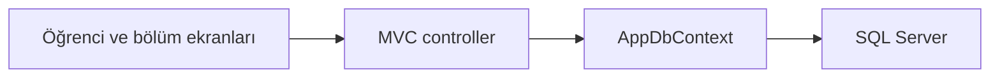

<div align="center">

# Öğrenci Bilgi Sistemi

### Öğrenci kayıtlarını sade bir yönetim akışında birleştir.


[](LICENSE)

Öğrenci kayıtları ve akademik bölümler arasındaki ilişkileri Entity Framework Core ile yöneten web uygulaması.

**Öğrenci ve bölüm yönetimi**

[Projeyi keşfet](https://github.com/silanpehlivan/OgrenciSistemi/tree/master) · [Kurulum ve ayrıntılar](#projeyi-çalıştırmak-ve-incelemek)

</div>

---

## İçeride neler var?

- **01** · Öğrenci ekleme, düzenleme ve listeleme
- **02** · Bölüm atama ve not ortalaması takibi
- **03** · SQL Server bağlantısı ve migration yönetimi

## Projeyi çalıştırmak ve incelemek

<details>
<summary><strong>Kurulum, kod yapısı ve teknik notları aç</strong></summary>

## Öne Çıkanlar

- Öğrenci ekleme, düzenleme ve listeleme
- Bölüm atama ve not ortalaması takibi
- SQL Server bağlantısı ve migration yönetimi

## Teknolojiler

C# · ASP.NET Core MVC · EF Core

### Teknik yaklaşım

Student ve Department modelleri AppDbContext üzerinden saklanır; controller’lar kayıt işlemlerini, migration dosyaları şema değişikliklerini temsil eder.



### Kodu incelemeye başlayın

- [OgrenciBS/Controllers/DepartmentController.cs](OgrenciBS/Controllers/DepartmentController.cs)
- [OgrenciBS/Controllers/StudentController.cs](OgrenciBS/Controllers/StudentController.cs)
- [OgrenciBS/Data/AppDbContext.cs](OgrenciBS/Data/AppDbContext.cs)
- [OgrenciBS/Migrations/AppDbContextModelSnapshot.cs](OgrenciBS/Migrations/AppDbContextModelSnapshot.cs)

### Kapsam ve sınırlar

Veritabanı bağlantısı ve şema kurulumu gerekir; gerçek öğrenci verileriyle kullanım için erişim ve veri koruma kontrolleri ayrıca değerlendirilmelidir.


Bu proje, ASP.NET Core MVC mimarisi kullanılarak geliştirilmiş, öğrenci ve akademik bölüm yönetimini sağlayan modern bir web uygulamasıdır. MVC yapısı, Entity Framework Core ve katmanlı mimari prensipleri ile birleştirilerek sürdürülebilir ve ölçeklenebilir bir sistem tasarlanmıştır.

---

 Projenin Amacı
---

Bu projenin temel amacı, ASP.NET Core MVC mimarisini kullanarak gerçek dünya senaryolarına uygun bir öğrenci otomasyon sistemi geliştirmektir.

Bu kapsamda:

- Dinamik Entegrasyon: Veritabanı verilerinin anlık olarak arayüze yansıtılması  
- Clean Code: Temiz, okunabilir ve sürdürülebilir kod yapısı oluşturulması  
- MVC Uyumu: Backend ve frontend bileşenlerinin uyumlu çalışması  
- Veri Yönetimi: Öğrenci, bölüm ve akademik bilgilerin merkezi yönetimi  

---

 Temel Özellikler
---

## Öğrenci Yönetimi

- CRUD İşlemleri: Öğrenci ekleme, listeleme, güncelleme ve silme  
- Akademik Takip: Öğrenci not ortalaması (GPA) yönetimi  
- Bölüm Atama: Öğrencilerin bölümlerle ilişkilendirilmesi  

---

## Bölüm Yönetimi
---

- Bölüm Ekleme: Yeni akademik bölümlerin sisteme dahil edilmesi  
- Görsel Yönetim: Bölüm görsellerinin tanımlanması ve gösterimi  
- İlişkisel Yapı: Bölüm-öğrenci ilişkilerinin otomatik yönetimi  

---

 Teknik Detaylar
---

| Özellik | Açıklama |
|----------|----------|
| Dil | C# |
| Framework | ASP.NET Core MVC |
| Mimari | MVC (Model-View-Controller) |
| Veritabanı | Microsoft SQL Server (EF Core) |
| Frontend | Razor Pages, Bootstrap 5 |
| Paradigma | Nesne Yönelimli Programlama (OOP) |

---

 Implementasyon Detayları
---

Proje, Entity Framework Core kullanılarak geliştirilmiş olup veritabanı işlemleri `AppDbContext` üzerinden yönetilmektedir. Migration yapısı ile veritabanı sürüm kontrolü sağlanmaktadır.

### Örnek Model: Department

```csharp
public class Department
{
    public int Id { get; set; }
    public string Name { get; set; }
    public string Image { get; set; }

    // Bir bölümün birden fazla öğrencisi olabilir
    public ICollection<Student> Students { get; set; }
}
```

---

Uygulama, `StudentController` ve `DepartmentController` üzerinden gelen istekleri işleyerek Razor View yapısı ile kullanıcıya dinamik içerik sunmaktadır.

---

## Kurulum ve Çalıştırma

1.   **Projeyi İndirin**: Projeyi indirin ve bir klasöre çıkarın.
2.   **Çözümü Açın**: `OgrenciBS.sln` dosyasını Visual Studio ile açın.
3.   **Veritabanı Yapılandırması**: `appsettings.json` dosyası içindeki SQL Server bağlantı dizesini (Connection String) kendi sunucunuza göre düzenleyin.
4.   **Migration Uygulayın**: Package Manager Console üzerinden `Update-Database` komutunu çalıştırarak veritabanını oluşturun.
5.   **Projeyi Başlatın**: Projeyi **F5** tuşu ile derleyip başlatın.

---

## Proje Yapısı

Proje, katmanlı mimari prensiplerine uygun olarak şu şekilde yapılandırılmıştır:

```text
OgrenciSistemi-master/
├── OgrenciBS/
│   ├── Controllers/   # MVC Controller katmanı
│   ├── Data/          # DbContext ve veritabanı işlemleri
│   ├── Migrations/    # EF Core migration dosyaları
│   ├── Models/        # Veri modelleri (Student, Department)
│   ├── Views/         # Razor UI sayfaları
│   └── wwwroot/       # Statik dosyalar (CSS, JS, Resimler)
└── OgrenciSistemi.sln # Visual Studio Solution dosyası
```

---


</details>

---

<div align="center">

**© 2025 Şilan PEHLİVAN**

Bu proje MIT lisansı kapsamında sunulmaktadır. Kullanım ve dağıtım koşulları: [LICENSE](LICENSE).

</div>
